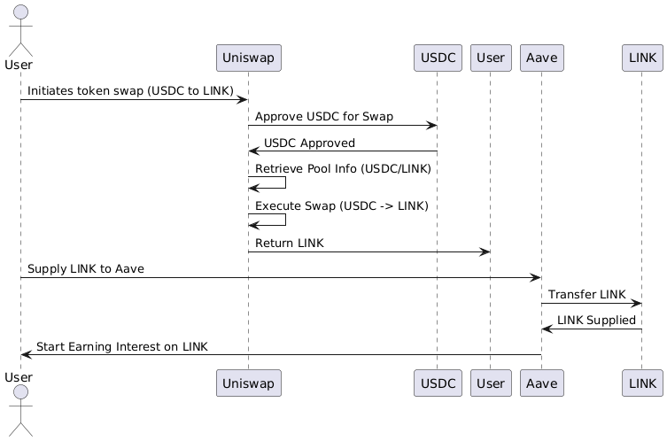

---

# DeFi Script: Uniswap and Aave Integration

## Overview of Script

This script demonstrates a DeFi workflow that integrates **Uniswap** and **Aave** protocols on the Ethereum Sepolia testnet. The script performs a token swap from USDC to LINK using Uniswap V3, and then supplies the swapped LINK tokens to Aave, allowing the user to start earning interest on their assets.

### **Workflow:**
1. **Token Swap (Uniswap):**
   - The script begins by approving the Uniswap Swap Router to spend a specified amount of USDC.
   - It then retrieves the necessary pool information for the USDC/LINK pair.
   - A swap is executed, converting the approved USDC into LINK tokens.

2. **Supply LINK (Aave):**
   - After the swap, the script interacts with Aave by supplying the swapped LINK tokens to the Aave protocol.
   - Aave then starts accruing interest on the supplied LINK tokens, enabling the user to earn passive income.

This integration showcases the composability of DeFi protocols, where assets obtained from one protocol can be directly utilized in another to enhance financial operations.

## Diagram Illustration

The following diagram illustrates the sequence of interactions between the protocols:



### **Diagram Description:**

1. **User** initiates a token swap on **Uniswap** to convert USDC to LINK.
2. **Uniswap** performs the swap after retrieving pool information and ensures the swap is successful.
3. The **User** supplies the swapped LINK tokens to **Aave**.
4. **Aave** starts accruing interest on the supplied LINK tokens, completing the workflow.

## Getting Started

### Prerequisites
- Node.js and npm installed
- An Ethereum wallet with Sepolia testnet ETH and USDC
- A registered Infura or Alchemy account for accessing the Sepolia testnet

### Installation
1. Clone the repository:
   ```bash
   git clone https://github.com/YourUsername/YourRepoName.git
   cd YourRepoName
   ```
2. Install dependencies:
   ```bash
   npm install
   ```

3. Create a `.env` file in the root directory and add the following:
   ```plaintext
   RPC_URL="https://sepolia.infura.io/v3/YOUR_INFURA_PROJECT_ID"
   PRIVATE_KEY="YOUR_PRIVATE_KEY"
   ```

### Running the Script
1. To execute the script, simply run:
   ```bash
   node index.js
   ```
2. Follow the terminal logs to monitor the progress of the swap and supply transactions.

## Conclusion
This script provides a practical example of how DeFi protocols can be integrated to create more advanced financial operations. By combining Uniswap and Aave, users can seamlessly swap tokens and start earning interest, all within a single script executed on the Ethereum Sepolia testnet.

---

